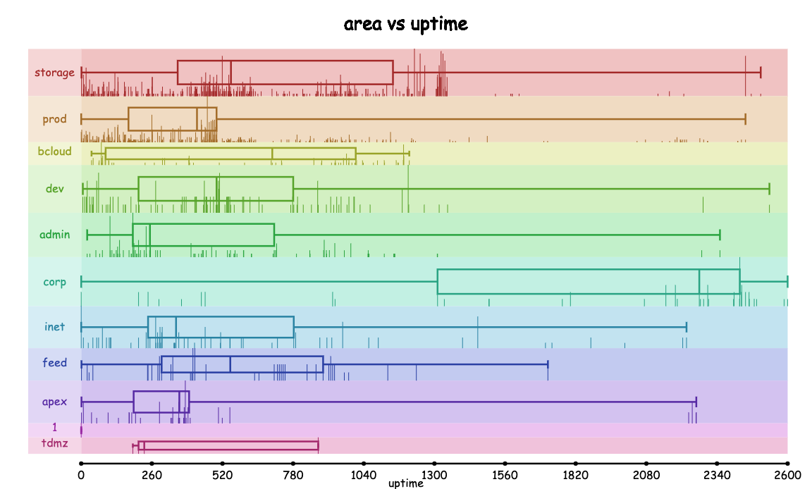

# Stat
Graph any set of datasets into frequency plots and box plots

## Usage

Upload a JSON file, paste the JSON object, or use a URL that points to a JSON file. Then, choose the quantitative variable (the variable to graph), the categorical variable (that identifies the name of the dataset). In the header, choose either Frequency or Box Plot in the Plots dropdown.

Use `https://github.com/SarangMohaniraj/Stat/data/BloombergDummyData.json` as an example. Choose `uptime` as the categorical variable and `area` as the categorical variable.

On the plots page, select which datasets you want to graph using the quantitative variable. You are able to compare as many as preferred. Select `pooled` to view a combined distribution. You can also select the range of the quantitative variable. You are given the option to choose the number of intervals on the horizontal axis and the scale of the vertical axis. `Overlap` renders the box plot on top of the frequency plot for enhanced visualization. Click `Filter` to apply changes, `Reset` to reset changes, and `Export` to download the chart.

You can see a statistical summary of each dataset by hovering over its respective section on the chart.